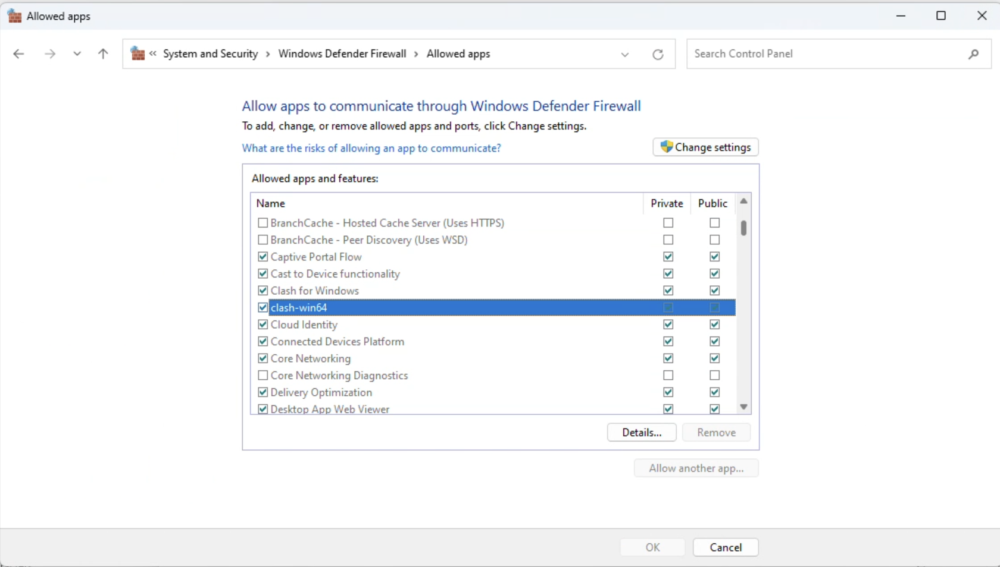

# Conda

## 更新conda版本失效

```bash
conda update conda
```

更新conda应该在base环境下，并且很可能更新完后conda版本仍然不变，原因是conda版本更新需要依赖其他的包，其他的包没更新，那么conda，也不会更新，正确做法应该是：

```bash
conda update --all
```

# WSL

如果又想用windows，又想用linux，建议使用Windows11中的WSL2

## 通过ssh远程连接WSL

## WSL如何翻墙

WSL翻墙一般使用windows的翻墙，
> 更多参考:[在 WSL2 中使用 Clash for Windows 代理连接_
](https://eastmonster.github.io/2022/10/05/clash-config-in-wsl/)

### 方法一

使用WSL2的最新特性，在 `C:\Users\<UserName>\.wslconfig` 文件中 (如果不存在就手动创建一个) 加入以下内容:

```
[wsl2]
networkingMode=mirrored
autoProxy=true
```
配置文件更改后需要重启wsl
这个方法可以让WSL2使用Windows的代理，还会导致WSL的ip与Windows一样，这样用ssh远程wsl会连接不了，但是不想用ssh连接wsl，而是只是想在本机Windows上用wsl，那这个方法最快最简单

### 方法二

翻墙软件要允许局域网连接allow alan，同时记住端口号，clash for windows是7890，


使用WSL2的最新特性，在 `C:\Users\<UserName>\.wslconfig` 文件中 (如果不存在就手动创建一个) 加入以下内容:

```
[wsl2]
memory=20G
dnsTunneling=false
autoProxy=false
```
配置文件更改后需要重启wsl

这个不会强制让WSL使用Windows的代理，WSL会是一台独立的电脑，ip与windows不一样，这样就还能保证ssh远程连接wsl

编辑wsl中的`./bashrc`文件，如果使用zsh终端，应该编辑`./zshrc`，加入

```bash
host_ip=$(cat /etc/resolv.conf |grep "nameserver" |cut -f 2 -d " ")
export http_proxy="http://$host_ip:[端口]"
export https_proxy="http://$host_ip:[端口]"
```

保存完后，在终端输入，如果使用zsh，应该改成`source ./zshrc`

```
source ./bashrc
```

还有关键的一步，windows的防火墙要允许翻墙软件通讯，clash for winodws和clash-win64都设置



再终端输入如下命令，进行验证，没有wget可以先安装

```bash
wget www.google.com
```
返回这个表示可以

